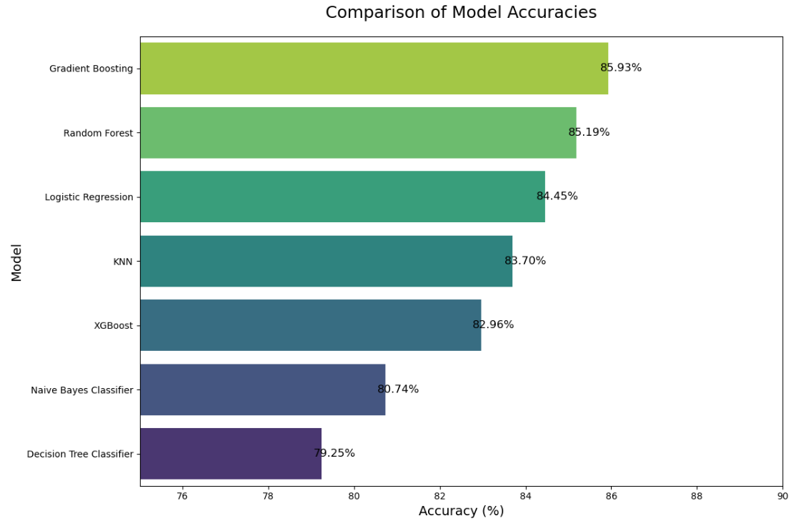

# Titanic Survival: A Foundational Deep Dive into Principled Data Science

A comprehensive, first-principles approach to statistical modeling and machine learning using the classic Titanic dataset. This repository demonstrates a rigorous, end-to-end analytical workflow, from statistical exploration to interpretable modeling.

---

### 📊 Key Finding at a Glance

The analysis confirms that survival was far from random. Based on the model, the passenger with the highest probability of surviving the Titanic disaster was a wealthy, young, female passenger from 1st class who boarded at Cherbourg and was not part of a large family. Conversely, the passenger with the lowest chance was an older, male passenger from 3rd class who was part of a large family.


The analysis concluded that while several models performed well, the ensemble boosting techniques delivered the highest accuracy. **Gradient Boosting** emerged as the top-performing model with an accuracy of **85.93%**.



---

### 🚀 Project Philosophy

The Titanic dataset, while foundational, provides a unique opportunity to showcase a mastery of process. This project was designed not merely to predict an outcome, but to conduct a **systematic investigation** into how different classes of machine learning models handle the same dataset.

The core philosophy is to demonstrate a deep, principled approach at every stage:
*   **Statistical Rigor:** Moving beyond basic EDA to validate every hypothesis with appropriate statistical tests.
*   **Methodical Preprocessing:** Justifying every feature engineering and data-cleaning decision.
*   **In-depth Model Evaluation:** Analyzing not just *if* a model works, but *how* it works by checking its assumptions and interpreting its results.
*   **Breadth of Knowledge:** Implementing and comparing a wide array of models, from interpretable linear classifiers to complex non-linear ensembles.

---

### 📂 Project Structure

This project is organized into a clean, multi-step workflow. The `notebooks/` directory contains the core analysis, split into two logical parts:

```
└── Principled-Data-Science-Titanic/
    ├── 📁 data/
    │   ├── 📄 Titanic-Dataset.csv         (The original, untouched data)
    │   └── 📄 processed_titanic_dataset.csv   (Cleaned, model-ready data)
    │   └── 📄 data_after_lr_model.csv   (data afte lr model, used for other algorithms for comparison)
    │
    ├── 📁 notebooks/
    │   ├── 📄 01_EDA_and_Feature_Engineering.ipynb
    │   └── 📄 02_Model_Building_and_Interpretation.ipynb
    │   └── 📄 03_Experimenting_on_other_algorithms.ipynb
    │
    ├── 📁 visualizations/
    │   ├── 🖼️ A Stark Divide.png
    │   └── 🖼️ What Drives the Odds.png
    │   └── 🖼️ Comparison between the models.png
    │
    └── 📄 README.md
```

---

### 🛠️ Tech Stack

| Technology | Purpose |
| :--- | :--- |
| **Python** | Core programming language. |
| **Pandas & NumPy** | Data manipulation, cleaning, and numerical operations. |
| **Matplotlib & Seaborn** | Comprehensive and aesthetic data visualization. |
| **SciPy.stats** | For executing rigorous statistical tests (Chi-Squared, ANOVA, Shapiro-Wilk). |
| **Statsmodels** | For checking multicollinearity with Variance Inflation Factor (VIF). |
| **Scikit-learn** | For the complete workflow: preprocessing, building, tuning, and evaluating most models. |
| **XGBoost** | For implementing the high-performance Gradient Boosting algorithm. |

---

### 🔬 Project Workflow & Key Stages

The project was executed in a structured, multi-stage workflow.

#### Stage 1: Foundational Analysis & Feature Engineering
The initial phase focused on a deep understanding of the data.
*   **Statistical EDA:** Each variable's relationship with the `Survived` target was statistically validated using **Chi-Squared tests** for categorical features and **ANOVA/t-tests** for numerical features.
*   **Feature Engineering:** A `Total Family Size` feature was engineered from `SibSp` and `Parch`, which proved to have a stronger statistical relationship with survival than its component parts. This feature was later discretized into meaningful categories.
*   **Systematic Imputation:** Multiple strategies for handling missing `Age` and `Embarked` data were tested empirically, with listwise deletion ultimately yielding the best model performance in initial tests.

#### Stage 2: In-Depth Study of a Linear Model (Logistic Regression)
To demonstrate depth, a Logistic Regression model was built with a strict focus on its underlying assumptions.
*   **Assumption Validation:** All key assumptions were checked, including the absence of severe multicollinearity (using **VIF**) and the linearity of log-odds.
*   **Handling Multicollinearity:** L2 regularization was employed to ensure model stability in the presence of moderate correlations between features.
*   **Interpretation:** The model was interpreted using **Odds Ratios**, providing clear, quantifiable insights into how factors like `Sex`, `Pclass`, and `Age` influenced survival.

#### Stage 3: A Comparative Study of Diverse ML Models
The core of the project was to evaluate how different algorithms approach the same problem. The following models were implemented and evaluated:
1.  **Naive Bayes:** Explored `Bernoulli`, `Multinomial`, and `Categorical` variants to handle the non-normal distribution of the numeric features, with `CategoricalNB` ultimately performing best.
2.  **K-Nearest Neighbors (KNN):** Implemented with mandatory feature scaling (`StandardScaler`) due to its distance-based nature. Interpretation was performed locally by analyzing the neighbors of specific predictions.
3.  **Decision Tree:** Built and interpreted visually. Hyperparameters (`max_depth`, `min_samples_leaf`, etc.) were tuned using **GridSearchCV** to control for overfitting.
4.  **Random Forest (Bagging):** An ensemble of decision trees was trained to reduce variance and improve accuracy. Feature importance was a key method of interpretation.
5.  **Gradient Boosting & XGBoost (Boosting):** Advanced ensemble techniques were used, where trees are built sequentially to correct the errors of their predecessors. These models yielded the highest predictive accuracy.

---

### 📊 Key Insights Across Models

A key takeaway is the remarkable consistency of the most important predictive factors across all high-performing models (Logistic Regression, Random Forest, and Gradient Boosting):

*   **`Sex_male`:** Consistently the most impactful feature. Being male dramatically decreased the chances of survival.
*   **`Pclass`:** Passenger class was the second most critical factor, with 3rd class passengers having a significantly lower survival rate.
*   **`Age` & `Fare`:** These numeric features consistently ranked high in importance, confirming that younger passengers and those who paid higher fares had better survival odds.

---

### 🚀 How to Run this Project

1.  Clone this repository:
    ```bash
    git clone https://github.com/YourUsername/Your-Repo-Name.git
    ```
2.  Navigate to the project directory:
    ```bash
    cd Your-Repo-Name
    ```
3.  Install the required dependencies:
    ```bash
    pip install -r requirements.txt
    ```
4.  Open the Jupyter Notebook `Titanic dataset (4).ipynb` and run the cells.
    ```bash
    jupyter notebook "Titanic dataset (4).ipynb"